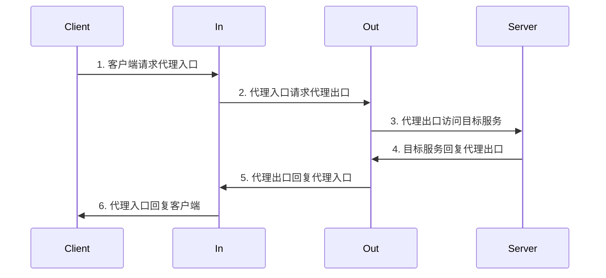

## 数据链路

大致数据链路如下图所示，基本思路是客户端经两级跳转访问服务端。



具备以下特点：
+ 完整链路信息只有客户端得知，客户端看起来只是在访问`In`
+ 只有`In`知道在访问`Out`，也只知道在访问`Out`，不知道实际目标
+ 服务端只知道请求来自`Out`，不知道客户端存在

## 客户端配置

> 参考文档: [dialer-proxy](https://wiki.metacubex.one/config/proxies/dialer-proxy/)

代理节点部分核心配置如下:

```yaml
proxies:
  - name: in  # 代理入口，常规配置
    type: ...
  - name: out # 代理出口，需要声明代理入口
    dialer-proxy: in
    type: ...

rules:
  - MATCH,out # 此处选择`out`节点
```

代理组部分核心配置如下:

```yaml
proxy-groups:
  - name: PROXY # 默认代理策略，可以SAFE优先，也可以原生优先，推荐保证可用
    type: select
    proxies:
      - PROXY-SAFE
      - RAW
  - name: PROXY-CHEAP # 低计费策略，优先低倍率节点，推荐保证可用
    type: select / url-test / fallback
    proxies:
      - <node-name>
      - RAW
  - name: PROXY-SAFE # 稳定出口策略，不推荐自动回落
    type: select
    proxies:
      - <node-name>
  - name: dialer-in # 代理入口组，推荐保证可用且整体低延迟
    type: select / url-test / fallback
    hidden: true # 可以隐藏
    proxies:
      - <node-name>
  - name: RAW # 原生节点组
    type: select
    proxies:
      - <node-name>
```

## 服务端配置

```yaml
# 代理服务端，以直连模式运行
mode: direct
listeners:
  # 服务协议：VMess
  # 传输方式：WebSocket 
  - name: vmess-ws&grpc
    type: vmess
    # 仅允许本机(反向代理)访问
    listen: 127.0.0.1
    # 服务端口
    port: 10800
    users:
      - username: 1
        uuid: <uuid>
        alterId: 0
    # WebSocket路径
    ws-path: /<websocket-path>/
    # gRPC服务名称
    grpc-service-name: <grpc-server-name>
```

```conf
# SSL证书配置
ssl_certificate     /path/to/cert.pem;
ssl_certificate_key /path/to/cert.key;

map $http_connection $connection_upgrade {
  "~*Upgrade" $http_connection;
  default keep-alive;
}

server {
    # 监听443端口，启用SSL加密，启用HTTP2(以支持gRPC)
    listen 443 ssl http2;
    listen [::]:443 ssl http2;
    # 服务器名称
    server_name <server-name>;
    gzip off;
    # 常规站点配置
    location / {
        add_header Content-Type 'text/plain; charset=utf-8';
        return 200 'hello, this is my site';
    }
    # 反向代理WebSocket
    location /<websocket-path>/ {
        proxy_http_version 1.1;
        proxy_set_header   Upgrade $http_upgrade;
        proxy_set_header   Connection $connection_upgrade;
        proxy_set_header   Host $host;
        proxy_set_header   X-Forwarded-For $proxy_add_x_forwarded_for;
        proxy_set_header   X-Forwarded-Proto $scheme;
        proxy_cache_bypass $http_upgrade;
        proxy_pass         http://127.0.0.1:10800;
    }
    # 反向代理gRPC
    location /<grpc-server-name>/ {
        grpc_pass        grpc://127.0.0.1:10800;
    }
}
```

## 其他配置(客户端规则)

路由规则如下:

```yaml
rules:
  # 拦截广告规则
  - RULE-SET,reject,REJECT
  # 直连私网、境内服务等
  - RULE-SET,private,DIRECT
  - RULE-SET,icloud,DIRECT
  - RULE-SET,apple,DIRECT
  - RULE-SET,direct,DIRECT
  - RULE-SET,lancidr,DIRECT
  - RULE-SET,cncidr,DIRECT
  - DOMAIN-SUFFIX,cn,DIRECT
  - DOMAIN-KEYWORD,-cn,DIRECT
  - GEOSITE,CN,DIRECT
  - GEOIP,LAN,DIRECT
  - GEOIP,CN,DIRECT
  # 本地共享、大流量传输优先低计费节点
  - RULE-SET,share,PROXY-CHEAP
  - RULE-SET,download,PROXY-CHEAP
  # 确保稳定出口的服务优先SAFE节点
  - RULE-SET,safe,PROXY-SAFE
  - RULE-SET,telegramcidr,PROXY-SAFE
  # 已知服务和无匹配默认代理访问
  - RULE-SET,gfw,PROXY
  - RULE-SET,proxy,PROXY
  - MATCH,PROXY
```

路由规则集合如下所示: \
在线规则集合参考项目: [Loyalsoldier/clash-rules](https://github.com/Loyalsoldier/clash-rules)

```yaml
rule-providers:
  # 大流量传输规则组
  download:
    type: inline
    behavior: classical
    payload:
      # huggingface model
      - DOMAIN-REGEX,^cdn-lfs.*.hf.co
      # dockerhub image
      - DOMAIN,production.cloudflare.docker.com
      # github image
      - DOMAIN,ghcr.io
      - DOMAIN,pkg-containers.githubusercontent.com
      # github storage
      - DOMAIN,objects.githubusercontent.com
      - DOMAIN,release-assets.githubusercontent.com
      # cloudflare R2 storage
      - DOMAIN-SUFFIX,r2.cloudflarestorage.com
      # sourceforge
      - DOMAIN-SUFFIX,dl.sourceforge.net
      # google drive
      - DOMAIN,drive.usercontent.google.com
      # youtube video
      - DOMAIN-SUFFIX,googlevideo.com
  # 确保出口稳定规则组
  safe:
    type: inline
    behavior: classical
    payload:
      - DOMAIN-SUFFIX,chatgpt.com
      - DOMAIN-SUFFIX,docker.com
      - DOMAIN-SUFFIX,docker.io
      - DOMAIN-SUFFIX,openai.com
      - DOMAIN-SUFFIX,redd.it
      - DOMAIN-SUFFIX,reddit.com
      - DOMAIN-SUFFIX,twimage.com
      - DOMAIN-SUFFIX,twitter.com
      - DOMAIN-SUFFIX,x.com
      - DOMAIN-KEYWORD,amazon
      - DOMAIN-KEYWORD,github
      - DOMAIN-KEYWORD,gmail
      - DOMAIN-KEYWORD,google
      - DOMAIN-KEYWORD,openai
      - DOMAIN-KEYWORD,reddit
      - DOMAIN-KEYWORD,youtube
  share:
    type: inline
    behavior: classical
    payload:
      - SRC-IP-CIDR,192.168.0.0/16
      - SRC-IP-CIDR,172.16.0.0/12
  reject:
    type: http
    behavior: domain
    url: https://cdn.jsdelivr.net/gh/Loyalsoldier/clash-rules@release/reject.txt
    path: ./ruleset/reject.yaml
    interval: 86400
  icloud:
    type: http
    behavior: domain
    url: https://cdn.jsdelivr.net/gh/Loyalsoldier/clash-rules@release/icloud.txt
    path: ./ruleset/icloud.yaml
    interval: 86400
  apple:
    type: http
    behavior: domain
    url: https://cdn.jsdelivr.net/gh/Loyalsoldier/clash-rules@release/apple.txt
    path: ./ruleset/apple.yaml
    interval: 86400
  proxy:
    type: http
    behavior: domain
    url: https://cdn.jsdelivr.net/gh/Loyalsoldier/clash-rules@release/proxy.txt
    path: ./ruleset/proxy.yaml
    interval: 86400
  direct:
    type: http
    behavior: domain
    url: https://cdn.jsdelivr.net/gh/Loyalsoldier/clash-rules@release/direct.txt
    path: ./ruleset/direct.yaml
    interval: 86400
  private:
    type: http
    behavior: domain
    url: https://cdn.jsdelivr.net/gh/Loyalsoldier/clash-rules@release/private.txt
    path: ./ruleset/private.yaml
    interval: 86400
  gfw:
    type: http
    behavior: domain
    url: https://cdn.jsdelivr.net/gh/Loyalsoldier/clash-rules@release/gfw.txt
    path: ./ruleset/gfw.yaml
    interval: 86400
  tld-not-cn:
    type: http
    behavior: domain
    url: https://cdn.jsdelivr.net/gh/Loyalsoldier/clash-rules@release/tld-not-cn.txt
    path: ./ruleset/tld-not-cn.yaml
    interval: 86400
  telegramcidr:
    type: http
    behavior: ipcidr
    url: https://cdn.jsdelivr.net/gh/Loyalsoldier/clash-rules@release/telegramcidr.txt
    path: ./ruleset/telegramcidr.yaml
    interval: 86400
  cncidr:
    type: http
    behavior: ipcidr
    url: https://cdn.jsdelivr.net/gh/Loyalsoldier/clash-rules@release/cncidr.txt
    path: ./ruleset/cncidr.yaml
    interval: 86400
  lancidr:
    type: http
    behavior: ipcidr
    url: https://cdn.jsdelivr.net/gh/Loyalsoldier/clash-rules@release/lancidr.txt
    path: ./ruleset/lancidr.yaml
    interval: 86400
```
