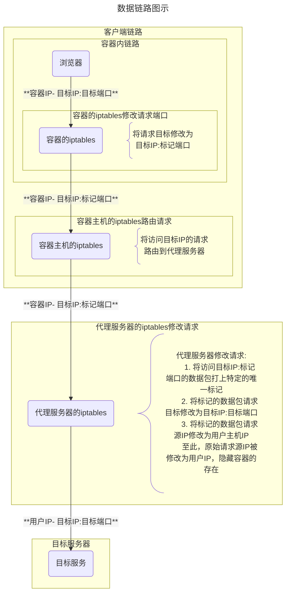

> 假定客户端`1.2.3.4`访问服务`5.6.7.8:5678`，标记端口`1234`

## 客户端规则

### 数据包修改

```bash
# 将访问{DST_IP}:{DST_PORT}的数据包中目的端口修改为{MARK_PORT}
iptables -t nat -A OUTPUT -d {DST_IP} -p tcp --dport {DST_PORT} -j DNAT --to-destination :{MARK_PORT}
```

```bash
## 示例
# 将访问5.6.7.8:5678的数据包中目的端口修改为1234
iptables -t nat -A OUTPUT -d 5.6.7.8 -p tcp --dport 5678 -j DNAT --to-destination :1234
```

### 路由跳转

> 将访问{DST_IP}的数据强制路由到动态代理服务(去进行后续的修改转发)

```bash
# 查看当前路由规则
route -n
# 获取默认网卡名称
ip -4 -o addr show | grep {HOST_IP} | awk '{print $2}' | head -n1
# 将访问特定IP的请求路由到动态代理服务(可以通过掩码修改为按段路由)
route add -net {DST_IP} netmask 255.255.255.255 gw {DPS_IP} {NET_NAME}
# 删除路由规则
route del -net {DST_IP} netmask 255.255.255.255 gw {DPS_IP} {NET_NAME}
```

## 服务端规则

### 启用规则

```bash
# 将访问{DST_IP}:{MARK_PORT}的数据包打上标记{MARK_PORT}
iptables -t mangle -A PREROUTING -p tcp -d {DST_IP} --dport {MARK_PORT} -j MARK --set-mark {MARK_PORT}
# 将被标记{MARK_PORT}的数据包转到实际目标端口{DST_PORT}
iptables -t nat -A PREROUTING -m mark --mark {MARK_PORT} -p tcp -j DNAT --to-destination :{DST_PORT}
# 将被标记{MARK_PORT}的数据包中的源IP修改为{SRC_IP}
iptables -t nat -A POSTROUTING -m mark --mark {MARK_PORT} -j SNAT --to-source {SRC_IP}
```

> 假定客户端`1.2.3.4`访问服务`5.6.7.8:5678`，标记端口`1234`

```bash
## 示例
# 将访问5.6.7.8:1234的数据包打上标记1234
iptables -t mangle -A PREROUTING -p tcp -d 5.6.7.8 --dport 1234 -j MARK --set-mark 1234
# 将被标记1234的数据包转到实际目标端口5678
iptables -t nat -A PREROUTING -m mark --mark 1234 -p tcp -j DNAT --to-destination :5678
# 将被标记1234的数据包中的源IP修改为1.2.3.4
iptables -t nat -A POSTROUTING -m mark --mark 1234 -j SNAT --to-source 1.2.3.4
```

### 撤销规则

> 与启用规则的区别是参数`-A`/`--append`修改为`-D`/`--delete`

```bash
iptables -t mangle -D PREROUTING -p tcp -d {DST_IP} --dport {MARK_PORT} -j MARK --set-mark {MARK_PORT}
iptables -t nat -D PREROUTING -m mark --mark {MARK_PORT} -p tcp -j DNAT --to-destination :{DST_PORT}
iptables -t nat -D POSTROUTING -m mark --mark {MARK_PORT} -j SNAT --to-source {SRC_IP}
```

### 查看规则

> 参数`-S`/`--list-rules`相对于`-L`/`--list`的输出更稳定且更适合程序处理

```bash
# 查看`mangle`表`PREROUTING`链中的规则
iptables -t mangle -S PREROUTING
# 查看`nat`表`PREROUTING`链中的规则
iptables -t nat -S PREROUTING
# 查看`nat`表`POSTROUTING`链中的规则
iptables -t nat -S POSTROUTING
```

输出如下

> 还包含其他规则、程序处理时必须严格过滤

```text
iptables -V

iptables v1.8.7 (nf_tables)

###

iptables -t mangle -S PREROUTING

-P PREROUTING ACCEPT
-A PREROUTING -d 5.6.7.8/32 -p tcp -m tcp --dport 1234 -j MARK --set-xmark 0x4d2/0xffffffff

###

iptables -t nat -S PREROUTING

-P PREROUTING ACCEPT
-A PREROUTING -m addrtype --dst-type LOCAL -j DOCKER
-A PREROUTING -p tcp -m mark --mark 0x4d2 -j DNAT --to-destination :5678

###

iptables -t nat -S POSTROUTING

-P POSTROUTING ACCEPT
-A POSTROUTING -s 172.17.0.0/16 ! -o docker0 -j MASQUERADE
-A POSTROUTING -s 172.19.0.0/16 ! -o br-a053f76f3ead -j MASQUERADE
-A POSTROUTING -s 172.18.0.0/16 ! -o br-51b383a5369c -j MASQUERADE
-A POSTROUTING -j LIBVIRT_PRT
-A POSTROUTING -m mark --mark 0x4d2 -j SNAT --to-source 1.2.3.4
```

```bash
# 查看`mangle`表`PREROUTING`链中的规则
iptables -t mangle -L PREROUTING
# 查看`nat`表`PREROUTING`链中的规则
iptables -t nat -L PREROUTING
# 查看`nat`表`POSTROUTING`链中的规则
iptables -t nat -L POSTROUTING
```

### 清空规则

> 清空操作也会把其他应用的规则给删掉(例如Docker)，强烈不推荐

```bash
# 清空`mangle`表`PREROUTING`链中的规则
iptables -t mangle -F PREROUTING
# 清空`nat`表`PREROUTING`链中的规则
iptables -t nat -F PREROUTING
# 清空`nat`表`POSTROUTING`链中的规则
iptables -t nat -F POSTROUTING
```

### 其他

```bash
# 查看iptables规则及过滤命令
iptables -t mangle -L PREROUTING --line-numbers | grep -E '^[[:digit:]]+[[:blank:]]+MARK'
```



